# SmartEvent – Event Discovery & Ticket Booking System

SmartEvent is a full-stack event discovery and ticket booking application built using **FastAPI, React, SQLAlchemy, SQLite, JWT authentication, Alembic, and QR code generation**.

The platform allows users to register and log in, discover events, search and filter events, book tickets, manage bookings, cancel bookings, generate digital tickets with QR codes, and receive booking notifications.

---

# Features

## Authentication

* User registration
* User login
* JWT-based authentication
* Password hashing using `pwdlib`
* Protected API routes
* Protected frontend routes
* User profile endpoint
* Automatic authorization using Bearer tokens
* Pydantic input validation
* User and Organizer roles
* Role-based access control

## Event Management & Discovery

* View available events
* Search events by title
* Filter events by category
* Pagination
* Event details page
* Ticket price display
* Available ticket inventory
* Event date and location information
* Organizer event creation
* Organizer event update
* Organizer event cancellation
* Organizer ownership validation
* Admin event deletion

## Ticket Booking

* Book event tickets
* Select ticket quantity
* Maximum 10 tickets per booking
* Automatic total price calculation
* Inventory validation
* Sold-out prevention
* Booking confirmation
* Booking history
* Booking cancellation
* Inventory restoration after cancellation
* Booking ownership validation

## Digital QR Tickets

* Generate unique ticket codes
* Generate QR codes
* Store generated QR images
* View tickets from the frontend
* Open QR codes directly
* Ticket ownership validation

## Notifications

* Booking confirmation notifications
* Booking cancellation notifications
* Notification list
* Unread notification count
* Mark individual notification as read

## Frontend

* React with Vite
* React Router
* Axios API integration
* JWT authentication state
* Protected routes
* Responsive UI
* Navigation bar
* Loading states
* Error messages
* Success messages
* Event discovery interface
* Booking confirmation page
* Booking history page
* Tickets page
* Notifications page

---

# Technology Stack

## Backend

* Python
* FastAPI
* SQLAlchemy
* SQLite
* Alembic
* Pydantic
* JWT
* pwdlib
* QRCode
* Pillow
* Uvicorn

## Frontend

* React
* Vite
* JavaScript
* React Router
* Axios
* CSS

---

# Project Structure

```text
smartevent/
│
├── backend/
│   │
│   ├── app/
│   │   ├── models/
│   │   │   ├── user.py
│   │   │   ├── event.py
│   │   │   ├── booking.py
│   │   │   ├── ticket.py
│   │   │   ├── notification.py
│   │   │   └── __init__.py
│   │   │
│   │   ├── schemas/
│   │   │   ├── auth.py
│   │   │   ├── event.py
│   │   │   ├── booking.py
│   │   │   ├── ticket.py
│   │   │   ├── notification.py
│   │   │   └── __init__.py
│   │   │
│   │   ├── routers/
│   │   │   ├── auth.py
│   │   │   ├── events.py
│   │   │   ├── bookings.py
│   │   │   ├── tickets.py
│   │   │   ├── notifications.py
│   │   │   └── __init__.py
│   │   │
│   │   ├── utils/
│   │   │   ├── security.py
│   │   │   ├── dependencies.py
│   │   │   └── __init__.py
│   │   │
│   │   ├── config.py
│   │   ├── database.py
│   │   ├── main.py
│   │   └── __init__.py
│   │
│   ├── alembic/
│   │   ├── versions/
│   │   └── env.py
│   │
│   ├── alembic.ini
│   └── .env
│
├── frontend/
│   │
│   ├── src/
│   │   ├── components/
│   │   │   ├── EventCard.jsx
│   │   │   └── Navbar.jsx
│   │   │
│   │   ├── context/
│   │   │   └── AuthContext.jsx
│   │   │
│   │   ├── pages/
│   │   │   ├── Login.jsx
│   │   │   ├── Register.jsx
│   │   │   ├── Home.jsx
│   │   │   ├── EventDetails.jsx
│   │   │   ├── BookingConfirmation.jsx
│   │   │   ├── BookingHistory.jsx
│   │   │   ├── Tickets.jsx
│   │   │   └── Notifications.jsx
│   │   │
│   │   ├── services/
│   │   │   └── api.js
│   │   │
│   │   ├── App.jsx
│   │   ├── main.jsx
│   │   └── index.css
│   │
│   ├── package.json
│   └── ...
│
├── screenshots/
│   ├── frontend/
│   │   ├── 01-login.png
│   │   ├── 02-home.png
│   │   ├── 03-event-details.png
│   │   ├── 04-booking-confirmation.png
│   │   ├── 05-booking-history.png
│   │   ├── 06-my-tickets-qr.png
│   │   ├── 07-notifications.png
│   │   └── 08-swagger-api.png
│   │
│   └── backend/
│       ├── 01-register-api.png
│       ├── 02-login-api.png
│       ├── 03-events-api.png
│       ├── 04-booking-api.png
│       ├── 05-ticket-api.png
│       ├── 06-notifications-api.png
│       └── 07-api-documentation.png
│
├── .gitignore
└── README.md
```

---

# Backend Setup

## 1. Open the Backend Directory

```powershell
cd C:\Users\shyamsundar\smartevent\backend
```

## 2. Create/Activate Virtual Environment

If the virtual environment already exists:

```powershell
..\venv\Scripts\Activate.ps1
```

The terminal should show:

```text
(venv)
```

## 3. Install Dependencies

```powershell
python -m pip install fastapi uvicorn sqlalchemy alembic pydantic pydantic-settings python-dotenv python-jose python-multipart email-validator pwdlib qrcode pillow
```

---

# Environment Configuration

Create a `.env` file inside the `backend` directory.

```env
DATABASE_URL=sqlite:///./smartevent.db

SECRET_KEY=smartevent-development-secret-key-change-later

ALGORITHM=HS256

ACCESS_TOKEN_EXPIRE_MINUTES=60
```

> For production, use a strong secret key and a production database.

> Do not commit the real `.env` file containing secrets to GitHub. Add `.env` to `.gitignore`.

---

# Database Setup

The project uses **SQLite** for development and **Alembic** for database migrations.

From the backend directory:

```powershell
python -m alembic upgrade head
```

Check migration status:

```powershell
python -m alembic current
```

Check whether model changes require a migration:

```powershell
python -m alembic check
```

Expected result:

```text
No new upgrade operations detected.
```

---

# Run the Backend

From:

```text
C:\Users\shyamsundar\smartevent\backend
```

Run:

```powershell
python -m uvicorn app.main:app --reload
```

Backend URL:

```text
http://127.0.0.1:8000
```

Swagger API documentation:

```text
http://127.0.0.1:8000/docs
```

Root endpoint:

```text
http://127.0.0.1:8000/
```

Expected response:

```json
{
  "message": "Welcome to SmartEvent API",
  "status": "running"
}
```

Health endpoint:

```text
http://127.0.0.1:8000/health
```

Expected response:

```json
{
  "status": "healthy"
}
```

---

# Frontend Setup

Open a second terminal.

```powershell
cd C:\Users\shyamsundar\smartevent\frontend
```

Install frontend dependencies:

```powershell
npm install
```

Run the frontend:

```powershell
npm run dev
```

Frontend URL:

```text
http://localhost:5173/
```

---

# Authentication API

Base URL:

```text
/api/v1/auth
```

## Register

```http
POST /api/v1/auth/register
```

Users can register with either the `USER` or `ORGANIZER` role.

## Login

```http
POST /api/v1/auth/login
```

The login endpoint returns a JWT access token.

## Profile

```http
GET /api/v1/auth/profile
```

Requires:

```http
Authorization: Bearer <access_token>
```

---

# Events API

Base URL:

```text
/api/v1/events
```

## Create Event

```http
POST /api/v1/events
```

Requires Organizer authorization.

## List Events

```http
GET /api/v1/events
```

## Search Events

```http
GET /api/v1/events?search=conference
```

## Category Filter

```http
GET /api/v1/events?category=Tech
```

## Pagination

```http
GET /api/v1/events?skip=0&limit=10
```

## Event Details

```http
GET /api/v1/events/{event_id}
```

## Update Event

```http
PUT /api/v1/events/{event_id}
```

Organizers can update only their own events.

## Cancel Event

```http
PATCH /api/v1/events/{event_id}/cancel
```

## Delete Event

```http
DELETE /api/v1/events/{event_id}
```

Requires Admin authorization.

---

# Booking API

Base URL:

```text
/api/v1/bookings
```

## Create Booking

```http
POST /api/v1/bookings
```

Example:

```json
{
  "event_id": 1,
  "ticket_quantity": 2
}
```

The backend automatically calculates:

```text
total_price = ticket_price × ticket_quantity
```

The available ticket inventory is reduced after a successful booking.

## Booking History

```http
GET /api/v1/bookings
```

## Booking Details

```http
GET /api/v1/bookings/{booking_id}
```

## Cancel Booking

```http
PUT /api/v1/bookings/{booking_id}/cancel
```

When a booking is cancelled, the booked ticket quantity is returned to event inventory.

---

# Ticket API

Base URL:

```text
/api/v1/tickets
```

## Generate Ticket

```http
POST /api/v1/tickets/booking/{booking_id}
```

A unique ticket code and QR code are generated.

## My Tickets

```http
GET /api/v1/tickets
```

## Ticket Details

```http
GET /api/v1/tickets/{ticket_id}
```

Generated QR codes are served through:

```text
/static/qr_codes/
```

---

# Notification API

Base URL:

```text
/api/v1/notifications
```

## Get Notifications

```http
GET /api/v1/notifications
```

## Get Unread Count

```http
GET /api/v1/notifications/unread-count
```

## Mark Notification as Read

```http
PUT /api/v1/notifications/{notification_id}/read
```

Notifications are automatically generated for:

* Booking confirmation
* Booking cancellation

---

# Frontend Pages

## Login

Users can authenticate using their registered email and password.

## Register

New users can create a SmartEvent account.

## Home

Users can:

* Browse events
* Search by title
* Filter by category
* Navigate through pages
* Open event details

## Event Details

Users can:

* View complete event information
* Select ticket quantity
* View calculated total
* Book tickets

## Booking Confirmation

Displays:

* Booking ID
* Event
* Category
* Location
* Date and time
* Ticket quantity
* Total amount
* Booking status

## Booking History

Users can:

* View previous bookings
* View booking status
* Cancel confirmed bookings

## Tickets

Users can:

* View generated tickets
* View ticket codes
* View QR codes
* Open QR codes

## Notifications

Users can:

* View notifications
* View unread count
* Mark notifications as read

---

# Frontend Screenshots

## Login Page

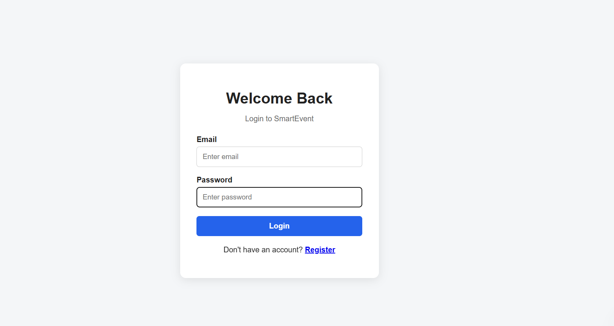

## Home – Event Discovery

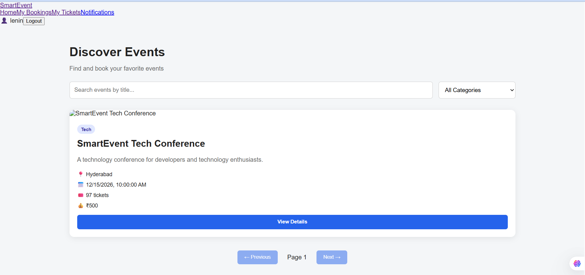

## Event Details

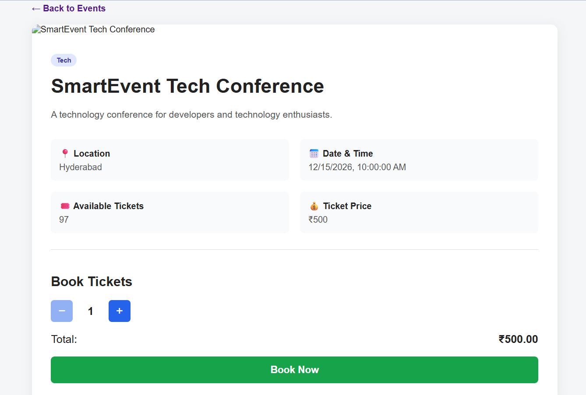

## Booking Confirmation

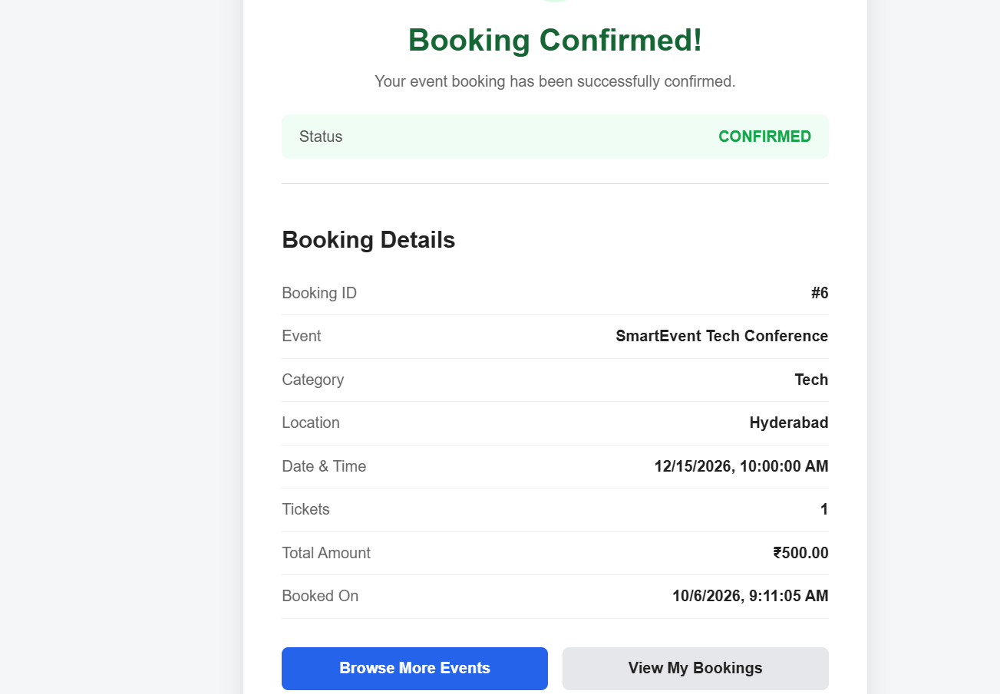

## Booking History

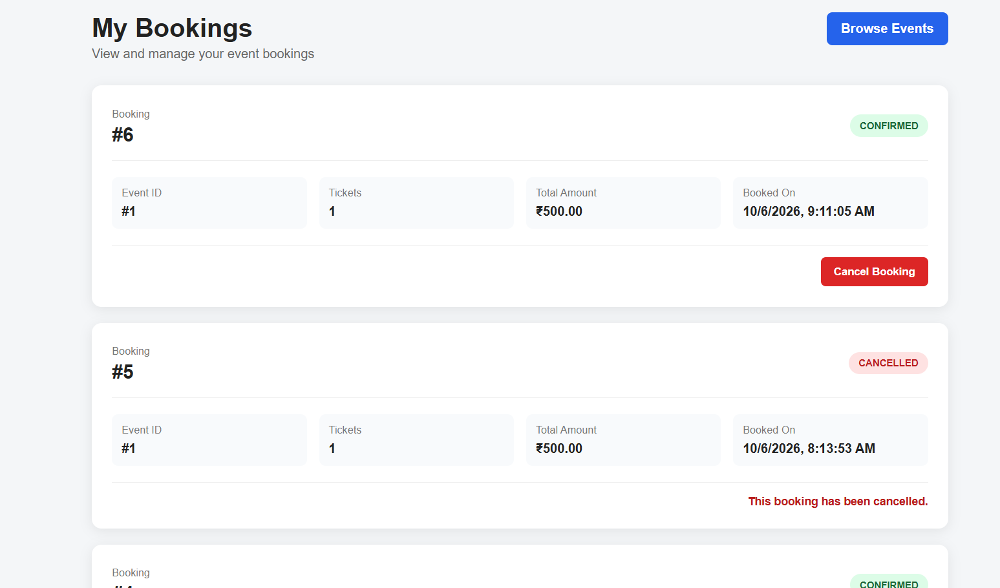

## My Tickets – QR Code

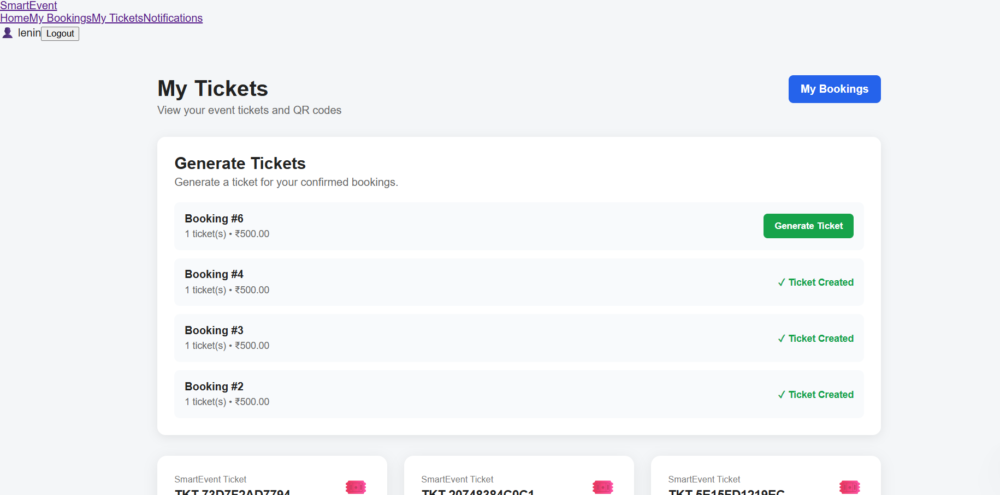

## Notifications

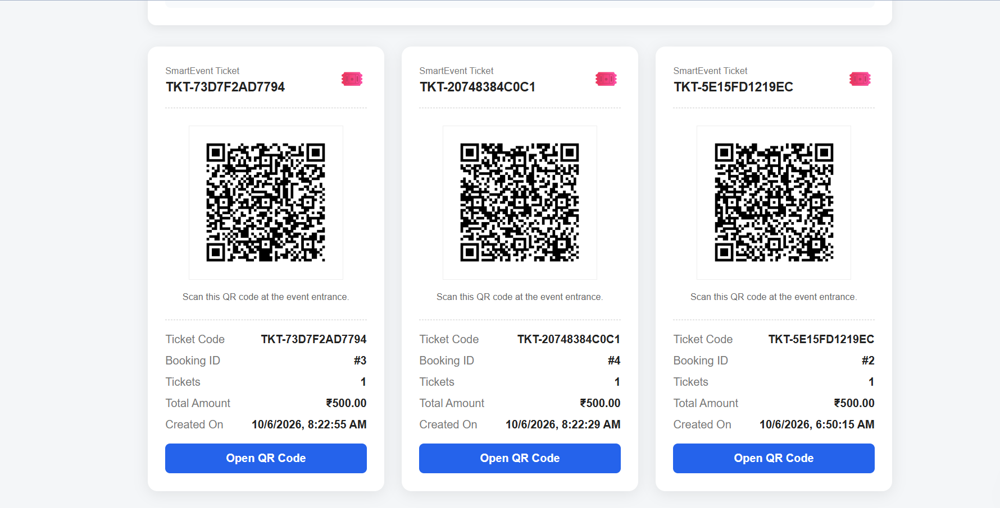

## Swagger API Documentation

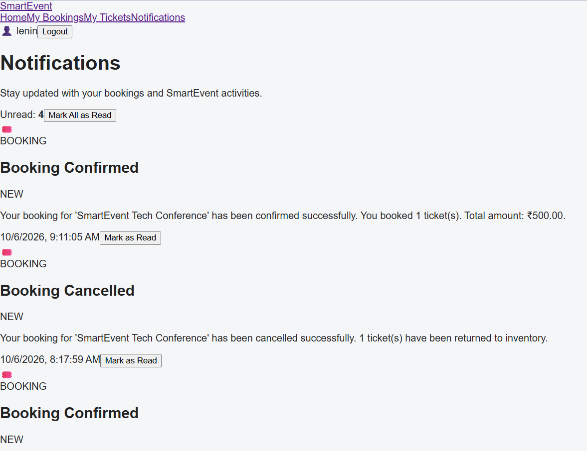

---

# Backend / API Screenshots

## Register API

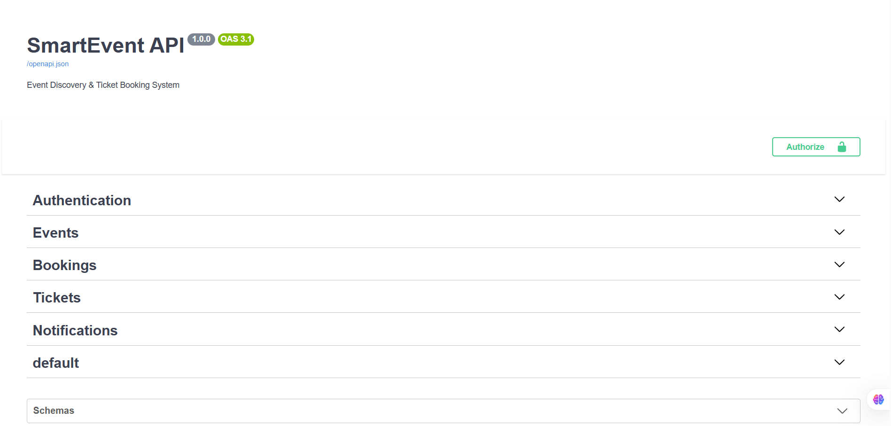

## Login API

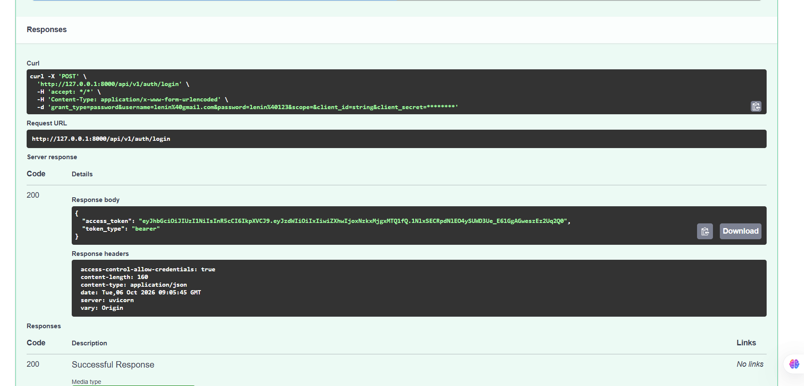

## Events API

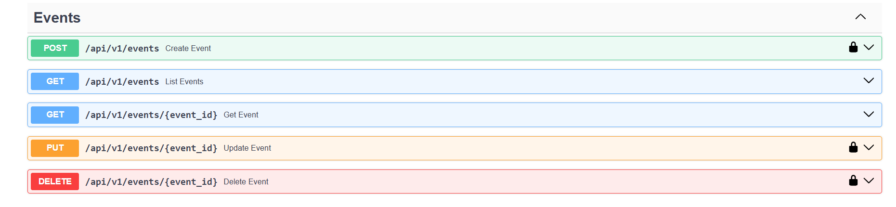

## Booking API

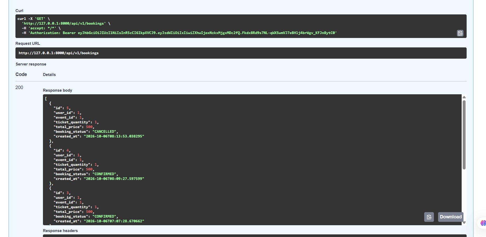

## Ticket API

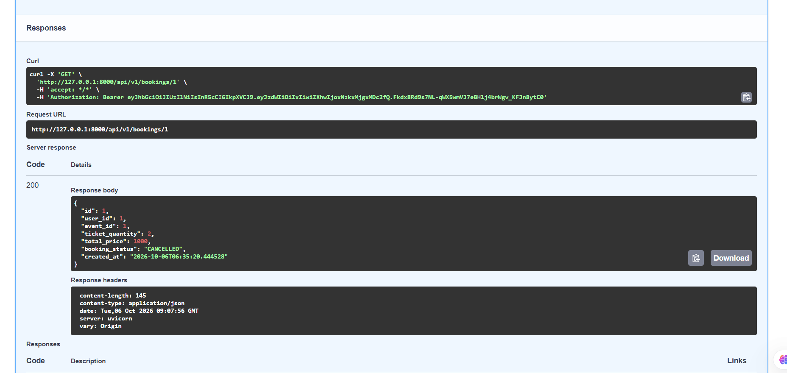

## Notifications API

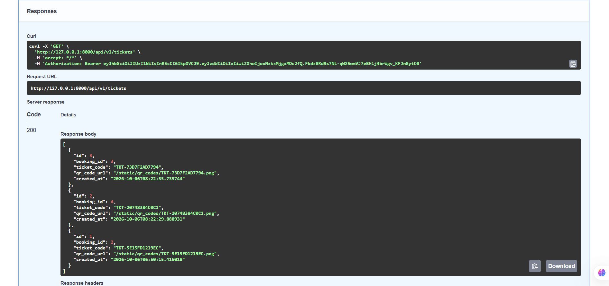

## API Documentation

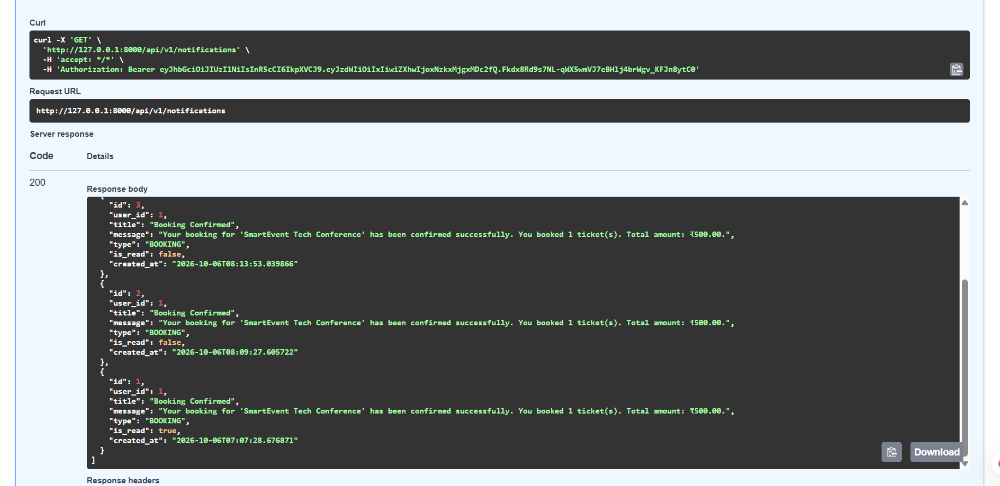

---

# Security

The application implements several security measures:

* JWT authentication
* Password hashing using `pwdlib`
* Protected API endpoints
* Protected React routes
* Role-based access control
* User ownership validation
* Organizer event ownership validation
* Pydantic request validation
* Ticket inventory validation
* Booking ownership checks
* Environment-based configuration
* CORS configuration
* Error handling

---

# Booking Flow

```text
User Login
    ↓
Browse Events
    ↓
Open Event Details
    ↓
Select Ticket Quantity
    ↓
Book Tickets
    ↓
Validate Availability
    ↓
Calculate Total Price
    ↓
Create Booking
    ↓
Reduce Available Tickets
    ↓
Create Booking Notification
    ↓
Booking Confirmation
    ↓
Generate Digital Ticket
    ↓
Generate QR Code
```

---

# Cancellation Flow

```text
My Bookings
    ↓
Select Confirmed Booking
    ↓
Cancel Booking
    ↓
Validate Booking Ownership
    ↓
Change Status to CANCELLED
    ↓
Restore Ticket Inventory
    ↓
Create Cancellation Notification
```

---

# Database Relationships

```text
User
 │
 ├── Bookings
 │      │
 │      ├── Event
 │      │
 │      └── Ticket
 │
 ├── Organized Events
 │
 └── Notifications
```

Main database tables:

```text
users
events
bookings
tickets
notifications
alembic_version
```

---

# Testing Completed

The following functionality has been tested.

## Authentication

* User registration
* User login
* JWT authentication
* Protected routes
* Invalid login handling
* Logout
* Protected frontend routes
* User profile

## Events

* Event creation
* Event listing
* Event search
* Event category filtering
* Event pagination
* Event details
* Event update
* Event cancellation
* Event deletion
* Organizer ownership validation
* Role-based access control

## Booking

* Ticket booking
* Ticket quantity validation
* Maximum booking quantity validation
* Ticket availability validation
* Booking confirmation
* Booking history
* Booking cancellation
* Inventory restoration
* Booking ownership checks
* Unauthorized booking access protection

## Tickets

* Ticket generation
* Unique ticket code generation
* QR code generation
* QR code display
* Ticket ownership validation

## Notifications

* Notification creation
* Notification listing
* Unread notification count
* Mark notification as read
* Booking confirmation notifications
* Booking cancellation notifications

## Frontend

* Frontend navigation
* Authentication flow
* Event discovery
* Event details
* Event search
* Event filtering
* Booking flow
* Booking history
* Ticket display
* QR code display
* Notifications
* Loading states
* Error handling
* Success messages

## Database

* Alembic migration execution
* Alembic migration consistency
* Database relationship verification
* Foreign key verification

Database migration verification:

```text
No new upgrade operations detected.
```

---

# Running the Complete Application

## Terminal 1 – Backend

```powershell
cd C:\Users\shyamsundar\smartevent\backend
```

Activate the virtual environment if required:

```powershell
..\venv\Scripts\Activate.ps1
```

Start FastAPI:

```powershell
python -m uvicorn app.main:app --reload
```

Backend:

```text
http://127.0.0.1:8000
```

Swagger:

```text
http://127.0.0.1:8000/docs
```

---

## Terminal 2 – Frontend

```powershell
cd C:\Users\shyamsundar\smartevent\frontend
```

Start React:

```powershell
npm run dev
```

Frontend:

```text
http://localhost:5173/
```

---

# Complete Application Flow

```text
Register
   ↓
Login
   ↓
JWT Authentication
   ↓
Home Page
   ↓
Browse Events
   ↓
Search / Filter
   ↓
Event Details
   ↓
Select Ticket Quantity
   ↓
Book Ticket
   ↓
Availability Validation
   ↓
Booking Confirmation
   ↓
Digital Ticket
   ↓
QR Code
   ↓
Booking History
   ↓
Notifications
```

---

# Future Improvements

Possible future enhancements include:

* Stripe payment integration
* Admin dashboard
* Event image upload
* Email notifications
* Advanced event recommendations
* Ticket download as PDF
* QR ticket validation scanner
* PostgreSQL production database
* Docker deployment
* Cloud deployment
* Automated tests with Pytest
* CI/CD pipeline

---

# Project Status

## SmartEvent Phase 1 – Event Discovery & Ticket Booking Platform

**Status: Completed**

Core authentication, role-based access control, event discovery, event management, booking, cancellation, QR ticket generation, notifications, database integration, Alembic migrations, and React frontend integration have been implemented and tested successfully.

---

# Author

**Lenin Marasu**

SmartEvent – Full Stack Event Discovery & Ticket Booking System
